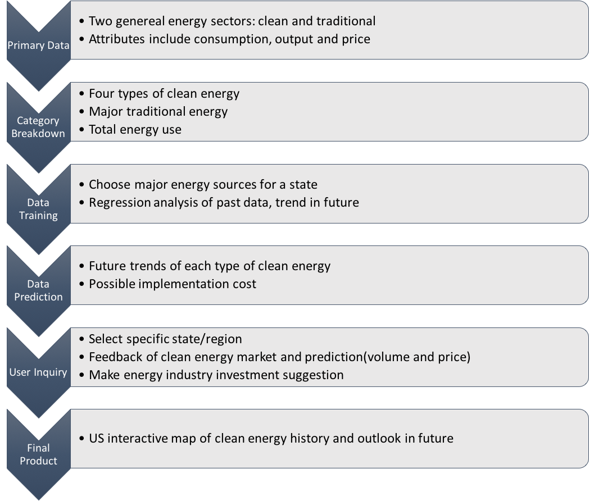

# Clean-Energy-Outlook
This is where we examine and map the clean world!

### Due Mar. 15, 2017 at 5PM

### Project Description
**Clean Energy Outlook** is a software that reads in energy generation data from 1960 to 2014 of various states of the United States and predicts the energy outlook of each state for the next 5 years. Software will be useful for investors and policy makers in renewable energy. Investors in clean energy can use this software to identify states where clean energy has high potential. Policy makers can also use this software to develop clean energy policies for different states.

### License Choice
We choose MIT License since it is a permissive license that is short and to the point. It lets people do anything they want with our code as long as they provide attribution back to us and don’t hold us liable.

### Directory Structure
We divide our directory into four parts: data, code, results and maps.  
We plan to store all our data (both inputs and outputs) in 'data' directory, then all the codes for the software we design in 'code' directory. Meanwhile, the results obtained from machine learning would be collected and stored into the results directory. Based on work above, 'maps' directory is for our visualizations.

Here is a simple tree plot of the current structure:
```
├── LICENSE
├── README.md
├── code
│   ├── data_clean
│   └── ml
├── data
│   ├── HYTCP
│   │   ├── inputs
│   │   └── outputs
│   ├── NUETP
│   │   ├── inputs
│   │   └── outputs
│   ├── SOEGP
│   │   ├── inputs
│   │   └── outputs
│   └── WYTCP
│       ├── inputs
│       └── outputs
├── maps
│   ├── dynamic
│   └── interactive
└── results
```
A flow map of our project:

