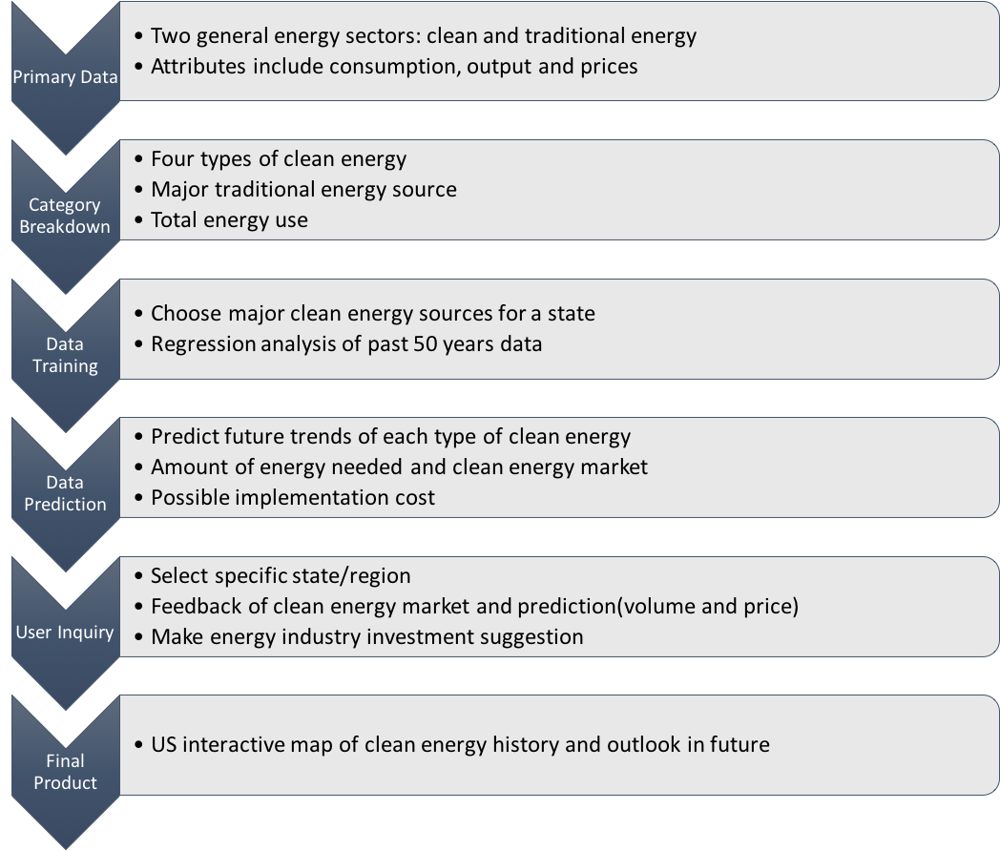

# Clean-Energy-Outlook
This is where we examine and map the clean world!

### Due Mar. 15, 2017 at 5PM

### Project Description
**Clean Energy Outlook** is a software that reads in energy generation data from 1960 to 2014 of various states of the United States and predicts the energy outlook of each state for the next 5 years. Software will be useful for investors and policy makers in renewable energy. Investors in clean energy can use this software to identify states where clean energy has high potential. Policy makers can also use this software to develop clean energy policies for different states.  

Clean Energy Outlook is a regression model that predicts the clean energy produced in the next 5 years for every state from previous 50 years' data, GDP, climate, oil price and other factors. Machine Learning algorithms like Linear Regression, Ridge Regression, and Lasso Regression from the scikit-learn library in Python are used to perform the regression. The output is an interactive map on Tableau with a time slider for the year and displays the amount of solar, wind, hydro, and nuclear energy produced in all the states for that particular year. It also has a drop down menu to select a state and view the trend of these 4 energies for the state selected with the projections for the future.  

### License Choice
We choose MIT License since it is a permissive license that is short and to the point. It lets people do anything they want with our code as long as they provide attribution back to us and don’t hold us liable.  

### Data Sources
All data sources are open source and can easily be obtained.
* State Energy Data System (https://www.eia.gov/state/seds/seds-data-complete.php)
* Domestic Crude Oil Prices (in $/Barrel) (http://inflationdata.com/Inflation/Inflation_Rate/Historical_Oil_Prices_Table.asp)

### Software Dependencies

All code is written in Python 3.5 version using open source libraries.  
* scikit-learn  
* pandas  
* numpy  

### Directory Structure
We divide our directory into four parts: data, code, results and maps.  
We plan to store all our data (both inputs and outputs) in 'data' directory, then all the codes for the software we design in 'code' directory. Meanwhile, the results obtained from machine learning would be collected and stored into the results directory. Based on work above, 'maps' directory is for our visualizations.

Here is a simple tree plot of the current structure:
```
├── LICENSE
├── README.md
├── code
│   ├── data_clean
│   └── ml
├── data
│   ├── HYTCP
│   │   ├── inputs
│   │   └── outputs
│   ├── NUETP
│   │   ├── inputs
│   │   └── outputs
│   ├── SOEGP
│   │   ├── inputs
│   │   └── outputs
│   └── WYTCP
│       ├── inputs
│       └── outputs
├── maps
│   ├── dynamic
│   └── interactive
└── results
```
### Flow Map  


